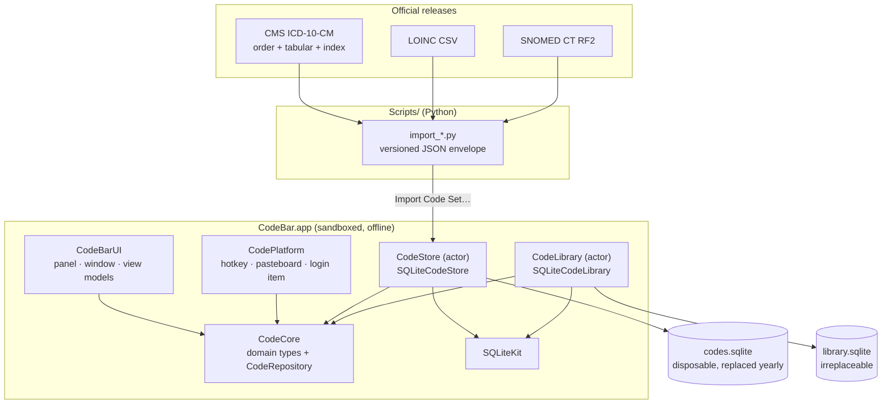

# CodeBar

**A native macOS app that puts the full ICD-10-CM code set behind one keystroke.**

Press ⌥⌘C from any application. Type a term or a code. Hit Return and it is on your clipboard. No browser tab, no network, no waiting.

| | |
|---|---|
| **Type** | Side project |
| **Role** | Sole designer and engineer |
| **Duration** | About a week of concentrated work on the rebuild, 50 commits between 11 and 16 August 2026, on top of an earlier prototype |
| **Status** | v0.1.0. Working daily driver. Not yet publicly released. |
| **Stack** | Swift 6, SwiftUI, AppKit, SQLite + FTS5, Carbon, Python 3, XcodeGen, GitHub Actions |
| **Source** | [github.com/yhmiller/CodeBar](https://github.com/yhmiller/CodeBar) |
| **Live demo** | None. It is a native macOS app, so there is nothing to link to in a browser. |
| **Docs** | Architecture, design review, code-set format spec and product research all live in the repo |

`[Hero image: the search panel floating over a half-written clinical note, one query typed, three ranked results underneath, the top one highlighted]`

---

## 01 — Overview

CodeBar is a menu bar app for looking up clinical codes: ICD-10-CM, LOINC, SNOMED CT and CPT.

Clinical coding systems are enormous. The current CMS ICD-10-CM release is 98,186 codes. Nobody memorises them, so every clinician and coder ends up doing the same thing: stop what you are writing, open a browser, search a web tool, copy the code, come back, paste it, find your place again.

CodeBar collapses that into a keystroke. It ships with a small starter set so it works the moment you build it, and imports the full official releases when you want them. Everything runs locally. Nothing about a patient leaves the machine.

The part I find most interesting is not the app. It is the search ranking, which turned out to be a genuinely hard problem with no clean technical answer, and where the fix I shipped is a product decision rather than an algorithmic one.

---

## 02 — The problem

I am an MSc Health Informatics candidate, finishing September 2026. Clinical code lookup is not an abstract problem to me. It is a thing I do, and a thing I watched consume more attention than it deserved.

The friction is not that the codes are hard to find. Plenty of web tools find them. The friction is that finding them costs you your place. You are mid-sentence in a note, you need a code, and getting it means leaving the thing you were doing, using a completely different interface, and coming back to reconstruct where you were. Multiply that by a clinic session.

There is a second problem underneath the first, and it is the one that made me want to build this properly rather than as a toy.

**The code text does not tell you whether the code is legal to submit.**

ICD-10-CM contains category headers that must never go on a claim. `E11` is "Type 2 diabetes mellitus". It looks like a code. It reads like a code. It requires a further character before it is valid, and submitting it is a denial. Nothing about `E11` distinguishes it from `A09` or `I10`, which are three characters and perfectly billable. CMS marks the difference in column 14 of a fixed-width text file. Almost a quarter of the official release, 23,467 of 98,186 codes, are these headers.

A lookup tool that hands you `E11` and says nothing has actively made your day worse.

`[Screenshot: a result row showing the amber "Category — not valid for submission" badge next to a code, with a billable sibling directly beneath it]`

---

## 03 — The idea

The first version was small and slightly embarrassing. Seven Swift files, roughly 400 lines, no Xcode project, no tests, no version control. A `MenuBarExtra`, a singleton wrapping SQLite, a global event monitor for the hotkey, and a hardcoded panel. It worked well enough to prove the shape was right, which was all I wanted from it.

The shape was: **the panel is the fast path, and speed is the entire product.** If it is not faster than opening a browser tab, it has no reason to exist.

What I deliberately left out at the start:

- **Any network call at lookup time.** Not a performance decision, a privacy one. The app is sandboxed and never talks to anything. That constraint has since killed more feature ideas than anything else, including the obvious one, natural-language search, which every commercial competitor now leads with.
- **Anything that makes a clinical judgement.** CodeBar re-presents what the publisher says. It never decides what the patient has.
- **Bundling the code sets.** ICD-10-CM is public domain, but LOINC needs a licence acceptance, SNOMED CT needs a UMLS affiliate account and CPT is proprietary AMA content. Shipping converters and letting people import their own licensed copies is the only version of this that is legally clean.

The scope grew in one significant way. It started as a panel and became a full app with a browse window, once it was clear that "copy a code fast" and "understand a code" are two different jobs. Fast lookup is a floating panel that gets out of your way. Understanding a code means the hierarchy, the publisher's coding notes, and your own annotations, which needs a real window with real navigation. Trying to serve both from one surface would have compromised both.

---

## 04 — Goals

**Product**

- Lookup should feel like a system reflex, not like using an application.
- Never hand someone a code that cannot go on a claim without saying so.
- The user's own data must be permanently safe from a code-set reimport.
- Useful immediately on first launch, with no setup.

**Technical**

- Full-text search over ~100k rows that stays responsive while typing.
- A storage boundary clean enough that the UI can be tested without a database.
- Swift 6 strict concurrency, with the compiler enforcing thread safety rather than a convention doing it.
- Idempotent imports. Running the same file twice must be a no-op.

**Learning**

- Native macOS at a level past tutorial code: `NSPanel` behaviour, activation policy, Carbon hotkeys, sandbox entitlements, notarisation.
- SQLite FTS5 in earnest, including where relevance ranking stops being the right tool.
- Whether I could hold a design system together in a codebase this small without it collapsing into ad-hoc values.

---

## 05 — The solution

Two surfaces, reached deliberately differently.

**The panel** is summoned by ⌥⌘C or the menu bar icon. It floats above everything, sizes itself to its results, copies, and disappears.

1. Press ⌥⌘C from whatever app you are in.
2. Type a term, a code, or clinical shorthand. `diabetes`, `E119` and `t2dm` all work, and both a code pass and a text pass run against the same query.
3. Arrow to a result, or press ⌘1 through ⌘9 to take a numbered row outright.
4. Return copies the code. Shift+Return copies `ICD-10-CM E11.9 — Type 2 diabetes mellitus without complications` instead, for pasting into a note rather than a code field.
5. A confirmation appears showing exactly what reached the clipboard, because the two formats are easy to confuse and a silent copy is one you verify by hand.
6. The panel dismisses itself and you are back where you were.

**The window** is opened from the Dock or the menu bar. Three columns: chapters, the code tree, and a detail pane carrying ancestry, children, billability and the publisher's own coding notes, including the `Excludes 1` rules that mean *never code these together*. Lists live in the sidebar, so you can build a problem list or an encounter template and export it as text or CSV.

`[Screenshot: the browse window, three columns, a code selected with its publisher notes visible in the detail pane]`

`[Screenshot: the panel empty state, showing pinned codes ready to copy before anything has been typed]`

---

## 06 — Key features

**One keystroke from anywhere.** The value is that lookup costs you nothing, so you actually do it instead of guessing. It is a Carbon `RegisterEventHotKey` registration, which needs no Accessibility permission, works inside the App Sandbox and consumes the event so it does not also reach whatever app is in front. If another app already owns ⌥⌘C, CodeBar says so at launch instead of failing quietly.

**Codes and text search at the same time.** You do not have to decide what kind of thing you are typing. `E119` finds `E11.9` because codes are indexed in a normalised, punctuation-free form alongside their display form. One SQL statement runs both passes and merges them under an explicit ordering.

**Clinical shorthand that actually resolves.** `uti` appears in no ICD-10-CM description, so searching it finds nothing however well the results rank. CodeBar expands about two dozen abbreviations nobody argues about, and Settings takes your own. Crucially it expands the *query*, never the code: `pcn` searching as "penicillin" is a fact about vocabulary, whereas pointing `pcn` at a specific code would be a clinical judgement made on your behalf, and a wrong one reaches a claim.

**Billability, surfaced.** Codes CMS marks as category headers carry an amber badge and sort below their billable siblings within a tier. They are still shown, because someone searching for a category deserves to find it, but a billable code wins a tie.

**Pins that survive everything.** Pin a code and it waits in the empty state next time you open the panel, so ⌥⌘C then Return copies it with nothing typed. Pins live in a separate database file from the code index, so importing a new yearly release cannot touch them.

**Lists you can get back out.** Right-click a list for Copy as Text or Export as CSV. The text form is worded exactly as Shift+Return writes a single code, so a list looks like something you have already pasted. A curated list you can only read inside the app that holds it is worth much less than one you can hand to someone.

---

## 07 — UX and design

I ran a full design review against the working app about halfway through, and it found something uncomfortable: the panel truncated the end of a code's description at one line inside a fixed 560pt window.

In most apps that is a cosmetic bug. Here it is the interface withholding the exact information the user opened it for. The clinical distinction in ICD-10-CM lives in the *tail* of the description. "Type 2 diabetes mellitus **without complications**" versus "**with hyperglycemia**". "Initial encounter for **closed** fracture". Truncating that is worse than showing nothing, because it looks like an answer.

That produced the first of eight design principles I now hold the app to:

> **Never truncate a code's meaning.** Wrap, widen or reflow. The end of a description is where the clinical distinction lives. Nothing in the layout outranks it.

The panel is 680pt now. Rows wrap. The others that earned their place:

> **Colour is a safety channel.** Amber, red and green mean billability and exclusion. They are never spent on taxonomy, decoration or brand.

> **The publisher outranks the user's note.** An always-open note editor used to sit between the code and the `Excludes 1` rules that mean never code these together. A personal reminder was outranking the fact that gets a claim denied.

Other decisions worth naming:

**No colour means "ICD-10".** The palette originally used orange for the CPT system badge and orange for "not billable", so on a CPT row two orange chips sat inches apart meaning unrelated things. System identity is carried by a neutral badge distinguished by its label. And the badge only appears at all when more than one code system is installed, because otherwise it reads "ICD-10" on every row forever while costing the description 84 points of row width.

**One row design, two densities.** The panel and the window were rendering the same object with two unrelated row designs. They share a component now. Density may change; anatomy may not.

**A 4pt spacing scale, because there wasn't one.** Five view files between them used padding of 1, 2, 3, 4, 6, 8, 9, 10, 12, 14, 18, 20 and 24. Each locally reasonable, collectively no rule, so nothing lined up and every new view was a fresh negotiation.

**Accessibility.** Result rows are proper accessibility elements. Reduce Motion suppresses the panel's fade. Every semantic colour has a high-contrast variant for Increase Contrast, and there is a snapshot test that renders the rows under it. The "not billable" label has a separate spoken form that leads with the noun a screen reader user is scanning for.

**Liquid Glass, mostly declined.** macOS 26's glass material goes on the panel root behind an availability shim, so macOS 14 and 15 keep `.ultraThinMaterial` and the deployment target never moved. It does not go on the footer, because the footer sits inside the root and that would be glass on glass. It does not go behind dense text anywhere. Apple's own guidance puts glass on the navigation layer and warns against it behind text you have to read carefully, which is nearly all of this app.

`[Screenshot: the same result row before and after, showing the truncated single-line version against the wrapped 680pt version]`

`[Screenshot: result rows rendered under Increase Contrast, from the snapshot test suite]`

---

## 08 — Architecture

In plain terms: six small Swift packages with enforced boundaries, two SQLite databases with opposite lifecycles, and a set of Python converters that turn official publisher files into a JSON format the app can read.

The app target itself is thin. It builds the object graph once, owns the floating panel and the window, and hands everything else to a package.



The important detail in that diagram is what is *missing*: there is no arrow from `CodeBarUI` to `CodeStore`. The UI depends on the `CodeRepository` protocol in `CodeCore` and never sees a concrete store. That is enforced by a shell script in the build gate, not by discipline.

```bash
# Tools/check-layering.sh — 21 rules, all of this shape
FORBIDDEN=(
  "CodeBarUI:CodeStore"
  "CodeCore:AppKit"
  "CodeCore:SwiftUI"
  "CodeLibrary:CodeStore"
  ...
)
```

If the UI can reach the concrete store, the seam stops meaning anything and the view models stop being testable without SQLite. A rule nobody checks is a rule that decays, so `make check` fails the build on a violation.

**Storage.** Two files, not two tables:

```
codes.sqlite     the code index. Rebuildable. Replaced by each yearly release.
library.sqlite   pins, usage history, lists, notes, custom abbreviations. Irreplaceable.
```

Both live inside the sandbox container. Importing a new release can never reach your own data, because the code doing the replacing has no handle on the other file.

**Concurrency.** Both stores are actors, not singletons. Search runs off the main thread, and actor isolation is what serialises access to a non-`Sendable` SQLite connection. The whole app target typechecks under Swift 6 strict concurrency as part of the build gate.

---

## 09 — Technology stack

| Technology | Purpose | Why I used it |
|---|---|---|
| Swift 6 | The entire app | Strict concurrency checking turns "is this thread safe?" from a code review question into a compiler error. Worth the migration friction. |
| SwiftUI | Panel, window, settings, all views | Fast to build, and it inherits OS refinements including Liquid Glass for free. |
| AppKit | `NSPanel`, activation policy, pasteboard | SwiftUI has no floating non-activating panel, no control over Dock icon presence, and no reopen hook. All three are load-bearing here. |
| SQLite + FTS5 | Code index and user library | Ships with the OS, needs no server, handles 98k rows with room to spare, and its BM25 implementation is good. `porter unicode61` tokenising means "diabetic" matches "diabetes". |
| Carbon `RegisterEventHotKey` | The global shortcut | The only macOS API that gives a system-wide hotkey without an Accessibility grant and without breaking the sandbox. Ancient, and still correct. |
| Python 3 | Code-set converters | The publisher files are fixed-width text, CSV and XML. Doing that parsing in the app would mean shipping parsers for formats that change once a year. |
| XcodeGen | Project generation from `project.yml` | The `.xcodeproj` is generated, so build settings live in reviewable YAML instead of a merge-hostile XML blob. |
| swift-snapshot-testing | Rendered-image tests | Covers the class of bug a view model genuinely cannot see, and it caught two. |
| GitHub Actions | Build gate and release pipeline | Runs the same `make check` locally and on a runner, then builds, signs and notarises a DMG. |

---

## 10 — Important technical decisions

### Decision: two databases, not one

**The problem.** An official yearly release is the complete code set for its year, so importing one should *delete* codes the publisher retired. Otherwise a retired code stays searchable forever, and a retired code copied onto a claim is a denial. But a user's pins, notes, lists and history must survive that reimport untouched.

**Options.** One database with an ownership column on each table. One database with separate table namespaces. Two separate database files.

**Decision.** Two files: `codes.sqlite` and `library.sqlite`.

**Why.** With one database, "delete everything not in this file" is a query I have to get right every single time, forever, under every future schema change. With two files, the destructive operation physically cannot reach the data I care about. The store doing the replacing has no handle on the other connection. It is a safety property enforced by structure rather than by care.

**Trade-offs.** No foreign keys across the boundary and no single-transaction consistency. The visible consequence is real: after a yearly release, `library.sqlite` can hold pins pointing at codes that no longer exist in the index, and nothing currently notices. That is a known gap with a designed fix waiting, and it is the direct cost of the split.

### Decision: FTS5 as an index, not as the source of truth

**The problem.** Version one stored codes *in* an FTS5 virtual table. That made imports non-idempotent, because an FTS5 table cannot carry a uniqueness constraint, so reimporting the same file doubled every row. Code-prefix search was also a full scan.

**Options.** Deduplicate in Swift before insert. Keep FTS5 authoritative and accept the duplicates. Move to a real table with an external-content FTS5 index.

**Decision.** A real `codes` table with `UNIQUE(system, code)` and a B-tree index on the normalised code, plus an external-content FTS5 index kept in sync by triggers.

**Why.** It makes imports idempotent at the database level via an upsert, rather than idempotent because the calling code remembered. It turns code-prefix search into an index range scan. And it lets me store things FTS5 has no room for: billability, parent, chapter.

**Trade-offs.** Three triggers to maintain, and a migration path from the old shape. The migration streams old rows through the normal upsert path rather than `INSERT ... SELECT`, which costs speed but collapses the duplicates version one left behind.

### Decision: Carbon over `NSEvent.addGlobalMonitorForEvents`

**The problem.** The original hotkey used a global event monitor. It appeared to do nothing.

**Options.** Request Accessibility permission and keep the monitor. Ship without a global shortcut. Use the Carbon Event Manager.

**Decision.** `RegisterEventHotKey`.

**Why.** The monitor was wrong in four ways at once. It required an Accessibility grant, which meant a permission prompt on first launch and no sandbox. It observed *every* keystroke system-wide to find one combination. It did not consume the event, so ⌥⌘C also reached whatever app was in front. And it failed **silently**: without permission it simply never fires, with no error to report. `RegisterEventHotKey` needs no entitlement, works sandboxed, watches only the combination it claims, consumes the event, and returns an `OSStatus` I can actually show the user.

**Trade-offs.** Carbon is a deprecated C API and using it means `Unmanaged` pointers, a global event handler function and a `MainActor.assumeIsolated` call. It also cannot be reassigned to an arbitrary key combination without more work, which is why the shortcut is still fixed at ⌥⌘C. Worth it: this is what let the whole app be sandboxed.

### Decision: three-state billability

**The problem.** Is this code valid to submit on a claim?

**Options.** A boolean, defaulting to false. A boolean, defaulting to true. An optional.

**Decision.** `Bool?`. True, false, or the source did not say.

**Why.** A boolean forces a lie in one direction or the other. Defaulting to `false` marks perfectly billable codes as headers. Defaulting to `true` is worse, because it tells someone a category header is safe to submit. LOINC and SNOMED CT have no billability concept at all, so their converters genuinely cannot answer, and the bundled starter set was never verified against the CMS file. Absent is a real, distinct state and modelling it as one is the honest option. It propagates all the way out: the CSV export writes an empty field for unknown, because writing `no` would turn a silence into a claim.

**Trade-offs.** Every consumer handles three cases instead of two. In ranking, unknown sorts with billable rather than being penalised, which is a judgement call I could defend either way.

### Decision: expand the query, never the code

**The problem.** `uti` appears in no ICD-10-CM description. Neither does `t2dm`. Ranking cannot help you: a code has to *match* before ranking gets a turn.

**Options.** Map each abbreviation to a specific code. Map each abbreviation to its expansion in words. Import a synonym set and hope it covers shorthand.

**Decision.** Expand to words. `uti` searches as `urinary tract infection`, and normal ranking decides which code fits.

**Why.** Mapping `uti` to a code is a clinical judgement made on the user's behalf, and a wrong one puts a wrong code on a claim. Mapping it to its own expansion is a fact about vocabulary, and the clinician still chooses from what comes back. The abbreviation is kept in the query alongside the expansion rather than replaced, so a code set that does spell out `GERD` still matches someone typing it.

**Trade-offs.** More work for the user at the last step, which is the correct place for the work to be. And the built-in table has to stay small: only expansions nobody argues about. `RA` is rheumatoid arthritis on most wards and the right atrium on some, so users add their own, and their entry wins over the built-in one.

---

## 11 — Implementation deep dive

### One statement, explicit tiers

Version one ran two separate queries with different limits and orderings and stitched the arrays together in Swift. Relative ranking between a code hit and a text hit was therefore an accident of iteration order.

Now both passes feed one statement, and the ordering is stated rather than emergent:

```sql
WITH code_hits AS (
    SELECT id,
           CASE WHEN code_norm = :norm THEN 0 ELSE 1 END AS tier,
           0.0 AS score
      FROM codes
     WHERE code_norm >= :norm AND code_norm < :norm_upper   -- range, not LIKE
     LIMIT :code_limit
),
text_hits AS (
    SELECT rowid AS id, 2 AS tier,
           bm25(codes_fts, 1.0, 1.0) AS score
      FROM codes_fts WHERE codes_fts MATCH :match
     ORDER BY bm25(codes_fts, 1.0, 1.0) LIMIT :text_limit
),
hits AS (SELECT * FROM code_hits UNION ALL SELECT * FROM text_hits)
SELECT ...
 GROUP BY c.id
 ORDER BY tier, not_preferred, header_last, MIN(h.score), LENGTH(c.code), c.code
 LIMIT :limit;
```

Three details in there that took work to get right:

The prefix match is a **half-open range**, not `LIKE 'E11%'`. `LIKE` is only index-optimised under specific collation and pragma conditions. The range form always is.

The `GROUP BY` collapses a code that matched both passes onto its best tier, which is what deduplicates the merged set.

And the sort keys are in a deliberate order. Exact code first, then personal preference, then billability, then relevance, then code length. Preference applies *within* a tier and never across one: someone typing `E11` means `E11`, however often they have used something else.

### Debounce with two cancellation points

```swift
pending?.cancel()
pending = Task { [debounce] in
    do { try await Task.sleep(for: debounce) } catch { return }  // 1
    let found = (try? await repository.search(query)) ?? []
    guard !Task.isCancelled else { return }                      // 2
    onResults(found)
}
```

Point one collapses a burst of keystrokes into a single query, and it is the common case. Point two is the one that matters for correctness: without the re-check after the `await`, a slow query for "dia" can land on top of a faster one for "diabetes" and overwrite it. Both are mutation tested, and the runner was extracted into its own type once the main window needed searching too, because two copies of that logic would be two chances to quietly lose it.

### Migrations that step forward one version at a time

Both databases migrate by stepping, so a database from *any* earlier build arrives intact rather than only from the immediately previous one. The code index is on schema v4, the library on v3.

The interesting case is detecting version one, which never set `user_version` and therefore reports 0, exactly like a brand new file. The tell is structural: a bare `codes_fts` table with no companion `codes` table can only have come from the old shape.

### Import as a versioned envelope

The converters emit a declared format rather than a bare array:

```json
{ "formatVersion": 1, "system": "ICD-10-CM", "release": "2026",
  "mode": "replace", "codes": [ ... ] }
```

`mode: "replace"` is the default for a full official release, because a merge-only import leaves retired codes searchable forever. The app confirms before acting on it, showing how many codes are installed against how many the file contains.

The declared `system` is **checked against the codes**, not trusted. A mislabelled file under replace semantics would delete the wrong system's codes entirely, so a file claiming to be LOINC while containing ICD-10 rows is rejected outright. A higher `formatVersion` than the build understands is also refused rather than half-read.

Bare arrays from the earlier scripts still load, but always merge, because such a file cannot declare itself complete and treating it as complete would be unsafe.

### The converters do real work

The CMS order file alone gives you flat codes. Two optional files change the app entirely:

- `--tabular` adds the hierarchy and the includes/excludes notes. Without it the browse window has nothing to browse and the coding rules are absent.
- `--index` adds the alphabetic index as search synonyms: 63,138 phrasings clinicians actually look codes up by. Without it, `chalasia` and `childhood asthma` match nothing, because those words appear in no description.

One subtlety cost me an evening. The tabular file does not enumerate everything. Seventh-character extensions like `S72.001A` are defined by rule rather than listed, which left **53,223 of 98,186 codes with no stated parent**, and every one of them looking like a top-level category in the tree. The fix fills a missing parent with the longest code that is a proper prefix, strictly as a fallback where the publisher is silent, never overriding a stated parent. Root count went from 53,223 to 1,918, which matches ICD-10-CM's actual count of three-character categories.

Parents are read from the publisher, never derived, for a reason worth stating: `E11.21`'s parent is `E11.2`, not `E11`. Trimming characters would build a confidently wrong tree.

---

## 12 — A difficult problem I solved

### The situation

Type "diabetes" against the real 98,186-code set and `E11.9`, "Type 2 diabetes mellitus without complications", does not appear near the top. Obscure, highly specific codes do.

This is the single most common lookup in outpatient practice, and the tool was burying it.

### Why it was difficult

BM25 was working exactly as designed. It ranks by how well text matches a query, and a code whose description repeats "diabetes" and "diabetic" several times scores higher than the plain one. There was no bug to fix.

The mismatch is conceptual. **Relevance and clinical frequency are different things, and the search engine only knows one of them.** No amount of tuning teaches BM25 that E11.9 is the diabetes code a given clinician reaches for every day, because that fact is not in the text.

Worse, `E11.9` was not merely ranked low. It never entered the candidate set at all: it scored below the top 50 text hits, so anything that only *reordered* results could never rescue it.

### Investigation

I tried the structural fixes first, and measured each one rather than eyeballing it.

**Weighting descriptions above synonyms.** The original 2:1 weighting was a guess made before there was anything to measure against. I swept 1 / 2 / 4 / 6 / 10 across fifteen queries against the real set. Equal weighting won on every metric: total rank **41**, against **65** at 2:1 and **154** at 10:1, degrading monotonically as the weight rose.

That result is counterintuitive until you see why. The alphabetic index is what makes many codes findable at all. Weighting descriptions above synonyms buries exactly the phrasings the index was imported to provide.

**Preferring shorter codes.** Measured. Worse than nothing.

**Capping synonyms per code.** Measured. Worse.

Then a narrower finding closed the door properly: within a code family, `N18.1`, `N18.31`, `N18.32` and `N18.5` tie on BM25 to two decimal places. There is no signal in the text to separate them. The tiebreak is arbitrary because the data is genuinely silent.

**No structural property of the text fixes this.** That was the conclusion, and it is worth more than the fix that followed.

### Solution

If the data cannot know which code you mean, use the one signal that does: your own behaviour.

Pins and usage history became a ranking input. But the important part is *how* it is applied, because the obvious implementation does not work.

Reordering results is not enough, since `E11.9` never entered the result set. So preferred codes get their own admission path:

```sql
preferred_hits AS (
    SELECT c.id, 2 AS tier, 0.0 AS score
      FROM codes c
     WHERE (c.system || '-' || c.code) IN (:pref0, :pref1, ...)
       AND c.id IN (SELECT rowid FROM codes_fts WHERE codes_fts MATCH :match)
)
```

Any code you use that matches the query at all is admitted, regardless of BM25 score, then ranked by preference within its tier.

Two constraints on it. Preference applies within a tier and never across one, so an exact code match still wins outright. And pins count immediately alongside accumulated usage, because pinning is an explicit statement that a code matters and waiting for usage to build up would ignore it.

This also fixed a second bug it was not aimed at. Selection in the panel was defined over `results`, which is empty until you type something, so Return in the empty state silently did nothing. The README had promised "⌥⌘C then Return, no typing" since the first version and it had **never worked**. Selection is now defined over pinned and recent codes before a query exists.

### Result

The codes you use are the codes you find. Cold start is unchanged, which I will come back to.

I want to be careful about what I claim here. I have the BM25 sweep numbers because I measured that specific question against the real code set. I do not have before-and-after task timings, because I did not instrument the app and I am not going to invent numbers. What I can say is that the behaviour I built the fix for, common codes buried under specific ones, does not happen for codes I have used, and does still happen on a fresh install.

The honest version of this result is in the repo's own README under "Known limits", where it stays.

---

## 13 — Things that didn't work

**A 2:1 BM25 weighting.** A guess dressed as a decision, made before there was a real code set to measure against. It was 60% worse than equal weighting on the metric I eventually used. It sat in the code looking deliberate for weeks.

**Every structural ranking fix.** Weighting descriptions, capping synonyms, preferring shorter codes. Three plausible ideas, three measurements, three regressions. The code-length heuristic is now explicitly marked "do not retry this" in the product notes, because it is the one that keeps sounding reasonable.

**FTS5 as the source of truth.** Cost me idempotent imports and index-optimised prefix search. Fixed by a schema rewrite and a migration.

**The global event monitor.** Cost a permission prompt, the sandbox, and a shortcut that failed silently.

**Colours in an asset catalogue.** This one is my favourite failure. `swift build` copies an `.xcassets` into the resource bundle **verbatim**. It never runs `actool`, so no compiled asset is produced and the colour lookup finds nothing at runtime. `xcodebuild` does compile it. So the app rendered the "not billable" chip correctly while `make check` rendered it as *nothing*, and the snapshot references would have locked that in as correct. The chip had gone invisible in the test suite and looked fine in the app. Colours are defined in Swift now, which resolves identically under both build systems.

**Autosaving the panel's frame.** The panel grows downwards as results arrive, that taller frame got saved, and every search nudged it further down the screen until it opened somewhere you had to drag it back from. It is placed fresh every time now. A panel you type into blind is better off landing in the same place than remembering a position nobody chose.

**Rebuilding the panel on every show.** The SwiftUI content was laid out only *after* the panel took key focus, so the first keystroke went missing. The panel and its hosting view are built once and reused.

**Liquid Glass on the footer.** The footer sits inside the panel root, so applying glass to both is glass on glass, which Apple's own adoption guide names as a mistake.

**`.focusable()` on result rows.** It would have fought the Tab-to-autocomplete behaviour added a phase earlier, and the accessibility need it was meant to serve was already met by ⌘P. The real gap was somewhere else entirely: the detail pane's child codes were tap-gesture only, so they were reachable by pointer and by nothing else.

**Piping `xcodebuild` into `grep`.** This one shipped a lie. The pipe hides the compiler's exit status, and a trailing `|| true` discarded what was left, so a build that failed to compile went on to install and launch the *previous* binary and report success. A fix that is silently not installed is worse than a visible failure.

---

## 14 — Performance, reliability and security

**Privacy is the architecture, not a policy.** The app is sandboxed with exactly two entitlements: the sandbox itself, and read/write access to files the user explicitly picks. There is no network entitlement, so there is no network. No telemetry, no analytics, no crash reporting, no account. A clinical tool that phones home is a different risk category, and the cheapest way to stay out of that category is to be unable to.

**Measured import performance**, against the real CMS ICD-10-CM FY2026 file, 98,186 codes:

| Step | Order file only | With `--tabular --index` |
|---|---|---|
| Python conversion | 0.9 s, 28 MB of JSON | 1.7 s, 44 MB |
| Decode | 382 ms, 112 MB peak | 569 ms, 159 MB peak |
| Ingest | 218 ms | 331 ms |
| Database on disk | 33 MB | 57 MB |
| Search | 0.1–64 ms | 0.1–47 ms |

The extra 24 MB buys the hierarchy, 23,910 coding notes and 63,138 index phrasings. Worth it.

**Input validation at the boundary.** The decoder refuses an unsupported format version, refuses a file whose declared system disagrees with its contents, and refuses an empty file. All three exist because the replace path is destructive.

**Error handling that surfaces.** If a database fails to open, the app says so in an alert and reports that search will not work, rather than returning empty results forever, which is what the first version did. A failed hotkey registration produces a warning naming the likely cause and pointing at the menu bar icon as the fallback.

**Hardened runtime is on**, and Release builds explicitly suppress the debugger-attach entitlement Xcode would otherwise inject, which Apple's notarisation requirements name as disqualifying. I turned both on before enrolling in the Developer Program specifically so the first *signed* build would not also be the first build under a different runtime.

**What is honestly not there.** No rate limiting, because there is no network surface to rate limit. No authentication, because there is no server and no multi-user story. No encryption at rest beyond the sandbox container and FileVault, which is a real gap if you consider a pinned code list to be patient-adjacent data, and I do not currently have a good answer for that.

**One known reliability limit.** Migrations run synchronously on the main actor at launch. Imperceptible at 98,186 codes, but a future schema change that rewrites rows rather than adding columns would block the app while it ran.

---

## 15 — Testing

Verified by running the gate, not by reading the README:

| Suite | Count | What it covers |
|---|---|---|
| Swift unit tests | **340** across six packages | Search SQL, ranking, migrations, ingest, envelope decoding, hierarchy, library, view models, key combos, panel placement |
| Rendered-image snapshots | 16 (inside the 340) | Rows, empty states, detail pane, footer, copy confirmation, Increase Contrast variants |
| Python converter tests | 45 | Fixed-width parsing, tabular XML, index synonyms, envelope output, parent inference |
| Interaction tests | 6 | Which window opens on launch, what reopening does, whether the panel stays out of the way |

`make check` runs the unit tests, the Python tests, a Swift 6 strict-concurrency typecheck of the app target and the module-boundary assertion. It passes clean. GitHub Actions runs the same gate on every push and pull request.

Three things worth saying about this suite.

**The snapshots earned their place twice.** They caught the invisible billability chip, and they caught a Liquid Glass problem I could not have reasoned my way to: applying the glass modifier inside the view rather than at the window collapsed the placeholder text's luminance range from 105 to **23**. The text was obscured, not dimmed, and changing its foreground style did nothing. Both were found by *looking at a re-recorded reference* rather than by a test failing, which is an argument for reviewing snapshot diffs rather than accepting them.

**Some of it is mutation tested.** The two cancellation points in the search runner, and the case-insensitivity of abbreviation storage. In the second case, removing the `COLLATE NOCASE` changed nothing, which correctly told me the collation was redundant because every write path lowercases already.

**What is not covered, plainly.** Typing, expanding the tree, selecting and copying are still verified by opening the app and using it. Snapshot references are machine specific, so they are skipped on CI and are a local gate only. And there is one case that cannot be covered at all: restoring a *minimised* window from the Dock. A test has to post the reopen event itself, and every way of doing that either restores the window as a side effect or is refused to the test runner.

---

## 16 — Deployment

```
project.yml  ──xcodegen──▶  CodeBar.xcodeproj  ──xcodebuild──▶  CodeBar.app
                                                                    │
                                          make dist ────────────────┤
                                                                    ▼
                                     sign ▶ DMG ▶ notarise ▶ staple ▶ verify
```

The Xcode project is generated and gitignored, so build settings live in reviewable YAML. `make install` builds Release, installs to `/Applications` and launches it. `make dist` produces a DMG.

The part I am happiest with is that **signing is opt-in and the same target works before and after enrolling in the Developer Program.** Set `SIGN_IDENTITY` and it signs. Set `NOTARY_PROFILE` and it notarises. Set neither and you get an unsigned DMG that Gatekeeper will refuse, which is still the right thing to build and test. The release workflow mirrors that exactly: it answers "have we a certificate" and "have we notarisation credentials" once at job level, because the secrets context is not available inside a step's `if` and a step-level check would never fire, quietly producing an unsigned DMG forever.

Packaging is the kind of thing that breaks silently and gets discovered on release day, so any change to the Makefile, the project file or the workflow rebuilds the DMG on a pull request. Nothing is published unless the trigger is a tag.

**Where it actually stands:** the pipeline runs green and produces `CodeBar-0.1.0.dmg`. That DMG is unsigned, because I have not enrolled in the Developer Program yet. Gatekeeper will refuse it, and the workflow says so out loud rather than shipping it quietly. Enrolment is the only thing standing between the current state and a downloadable build.

---

## 17 — Results

**Product.** A working macOS app I use. Full official code sets import in under a second and search in tens of milliseconds. The starter set means it does something useful the moment it is built.

**Technical.** A six-package Swift 6 codebase with machine-enforced boundaries, 340 passing tests, actor-isolated storage, a migration path that handles every schema version the app has ever written, and a release pipeline that signs and notarises when credentials exist.

**Personal.** I now know where full-text relevance stops being the right tool, which is a more useful thing to know than how to tune BM25. And I learned that measuring a ranking change is cheap, while reasoning about one is unreliable: three out of three of my plausible structural fixes made results worse, and I would have shipped at least two of them on intuition.

**Practical.** It solves the problem I built it for. I stop losing my place.

I am not going to claim users, downloads, or a workflow improvement I have not measured. The repository is private, there is no published release, and the only person using it is me. That is the accurate result.

---

## 18 — What I learned

**Measure ranking changes; do not reason about them.** Three structural fixes, all defensible, all worse. The 2:1 BM25 weighting sat in the code looking deliberate for weeks and was 60% worse than the equal weighting I replaced it with. My intuition about relevance was not just imperfect, it was consistently wrong in the same direction.

**"There is no technical fix" is a legitimate conclusion.** The most valuable output of the ranking investigation was not the fix. It was establishing that no structural property of the data could solve it, which is what made a product answer, your own pins, obviously correct rather than a cop-out.

**The build system is part of the correctness story.** Two of my most memorable bugs were build artefacts, not code: a colour that compiled under one build system and not the other, and a pipe that swallowed a compiler's exit status and reported a failed build as a successful install. Neither would have been found by reading the source.

**Enforce boundaries with a script, not with intent.** I wrote down the module rules in an architecture document and then wrote a shell script that fails the build on a violation. Only one of those two things is still true a month later.

**Domain constraints are design constraints.** Almost every good decision here came from the domain rather than from software engineering. Three-state billability, expanding abbreviations to words and never to codes, `excludes1` and `excludes2` kept distinct through the converter and the schema and the UI, the publisher's rules outranking the user's own note. None of that came from thinking about Swift.

**Optional is a modelling tool, not a nuisance.** `Bool?` for billability propagates through the schema, the ranking, the badge and the CSV export, and at every one of those points the third state is the *correct* answer rather than an inconvenience.

**A design review against a running app finds different bugs than a code review.** The description truncation had been there since the first version. It is invisible in the source, because the code says `lineLimit(1)` and that is obviously what it does. It is unmissable the moment you look at the screen while thinking about what the user came for.

---

## 19 — What I would do differently

**Design the orphan case at the same time as the split.** Two databases was the right call and I still think so. But the consequence, that a yearly release deletes codes while pins keep pointing at them, was foreseeable on day one and I did not design for it. A pinned code that no longer exists should read "retired in FY2027", not silently become an opaque identifier. CMS ships a retired-to-successor conversion table in the same download, so the fix was always available. I just did not think about it until the research phase.

**Instrument before optimising perception.** I have BM25 sweep numbers because I deliberately measured one question. I have no timing data on anything else, so several statements I would like to make about the app I cannot honestly make. A couple of `signpost` intervals around search would have cost an hour.

**Take the design pass earlier.** The token layer had to be built first and every later phase written against it, which meant redoing work that had already shipped. Doing that in week one would have cost less than doing it in week two.

**Not defer the interaction tests.** Every window and panel defect I hit was found by building the app and looking at it. The tests that would have caught them were written afterwards, which means they document bugs I already fixed rather than preventing new ones.

**Reconsider holding the whole import in memory.** Fine at 98k codes and fine for LOINC. SNOMED CT is several times larger and would push peak memory well past 159 MB. I would still not build streaming today, because an earlier estimate built on synthetic data was out by a factor of two in both code count and memory, and building for an unmeasured number is how you get the wrong abstraction. But I would want the measurement before someone imports a real SNOMED distribution.

**Write a LICENSE on day one.** The repository has none, which makes "I will open source this" more complicated than it needed to be.

---

## 20 — Future improvements

### Short term

- **Enrol in the Apple Developer Program.** The signing and notarisation pipeline is written and tested. It is one credential away from producing a build a stranger can open, and nothing else can ship until it does.
- **Reconcile orphaned pins after import.** The FY2027 release lands 1 October 2026: 190 new codes, 30 deleted, 4 revised. Those 30 deletions will orphan pins on that date. This is the only item on this list with an external deadline.
- **Show which release is installed.** Nothing currently says whether you are on FY2026, and a date of service before 1 October still needs the old set.
- **Correct the README.** It still says "No CI" and quotes stale test counts. Both were true when written.

### Medium term

- **A frequency-weighted tiebreak.** AHRQ publishes annual discharge counts per ICD-10-CM code, free and without a data use agreement. Swapping *only* the arbitrary `LENGTH(code)` tiebreak for a frequency weight cannot regress queries that already rank correctly, does not promote unspecified codes by rule, and fixes the one thing pinning cannot: cold start, where a fresh install has no history to rank on. Shaped as an optional weights file imported like a code set, so an unweighted install behaves exactly as today.
- **A seventh-character and laterality guard.** Decline to copy an incomplete code and offer the initial/subsequent/sequela picker inline. This is the `Excludes 1` idea carried one step further, and it is the difference between a fast search box and an actual coding tool.
- **Add to a list from the panel**, not only from the window.
- **A configurable hotkey**, which needs the Carbon registration to accept an arbitrary key combination.

### Long term

- **iCloud sync of the library.** The one parity gap competing tools advertise.
- **A Raycast or Alfred extension, and Shortcuts support.** Same index, almost no new surface, and it meets people where they already type.
- **SNOMED CT to ICD-10-CM crosswalks.** NLM publishes the map and both terminologies are free for US use, so this needs a UMLS account rather than a commercial licence.

**Deliberately refused:** AI natural-language to code, which several commercial tools now lead with. It needs the network, which breaks the privacy constraint the whole architecture is built on, and it puts the app in the business of clinical judgement that it exists to stay out of.

---

## 21 — Final takeaway

I built CodeBar because looking up a clinical code cost me my place in whatever I was writing, and because the tools that solve that problem quickly do not tell you when a code cannot legally go on a claim.

The interesting engineering turned out to be somewhere I did not expect. Not the hotkey, not the panel, not the SQLite schema, though all three took real work. It was the discovery that full-text relevance is structurally the wrong signal for this domain, that three plausible fixes for it all made things measurably worse, and that the correct answer was to stop looking for a technical fix and use the one signal the system actually had: what this particular person actually uses.

That is the thing I would want someone to take from this. The measurements are in the code comments, the failures are written down in the repository, and the limits are in the README where a user will see them before they rely on the tool.

It also happens to be exactly the kind of problem I want to work on: a real clinical workflow, a hard constraint that is about safety rather than performance, and a domain where getting it subtly wrong has consequences beyond a bad user experience.

---
---

# Suggested visuals

No product screenshots exist in the repository yet. Nothing below is invented; each is a shot you would need to take. The two marked **already exists** are real files you can use immediately.

| Placement | Visual | What it should show |
|---|---|---|
| Hero | The panel in context | The floating search panel over a half-written clinical note in another app, one query typed, three ranked results, top row highlighted. This one image carries the entire pitch. |
| § 02 The problem | Billability badge | A result row with the amber "Category — not valid for submission" badge, and a billable sibling directly beneath it. The whole safety argument in one row. |
| § 05 The solution | The browse window | All three columns populated: chapters, code tree, detail pane with publisher notes visible. |
| § 05 The solution | The empty state | The panel before anything is typed, showing pinned codes ready to copy. Demonstrates "⌥⌘C then Return, no typing". |
| § 06 Key features | Copy confirmation | The confirmation showing the full `ICD-10-CM E11.9 — Type 2 diabetes mellitus without complications` string, proving which of the two formats reached the clipboard. |
| § 07 UX and design | Before and after row | The truncated one-line 560pt row against the wrapped 680pt row. The single most persuasive image in the piece. |
| § 07 UX and design | Increase Contrast rows | **Already exists**: `Packages/CodeBarUI/Tests/CodeBarUITests/__Snapshots__/SnapshotTests/snapshot.result-rows-increased-contrast.png` |
| § 08 Architecture | Architecture diagram | The mermaid diagram in § 08. Renders natively on most platforms; export to SVG if your blog pipeline does not support mermaid. |
| § 11 Deep dive | Detail pane | **Already exists**: `snapshot.detail-pane.png`, showing publisher notes above the user's own note. |
| § 12 Difficult problem | Ranking before and after | A "diabetes" query on a fresh install against the same query once E11.9 has been pinned. Directly demonstrates the fix. |
| § 15 Testing | Snapshot grid | The 16 reference PNGs in `__Snapshots__/SnapshotTests/` tiled as a contact sheet. |
| § 16 Deployment | Pipeline | The ASCII diagram in § 16 redrawn, or a screenshot of a green Actions run. |

---

# SEO metadata

**SEO title** (56 chars)
`CodeBar: A Native macOS Clinical Code Lookup Tool`

**Meta description** (154 chars)
`I built a macOS menu bar app for ICD-10 lookup, then found that full-text relevance ranks clinical codes wrong. Here is what I measured and what I shipped.`

**Short description** (project card)
> A native macOS app that puts 98,186 clinical codes behind one keystroke. Sandboxed, offline, and honest about which codes cannot go on a claim.

**Tags**
`Swift 6 · SwiftUI · AppKit · SQLite FTS5 · Python · macOS · Health Informatics`

**Suggested URL slug**
`/projects/codebar` or `/blog/codebar-clinical-code-lookup-macos`

---

# Portfolio project summary

**Project:** CodeBar

**Description:** A native macOS menu bar app for clinical code lookup across ICD-10-CM, LOINC, SNOMED CT and CPT. Press ⌥⌘C from anywhere, type, hit Return, and the code is on your clipboard. Fully offline and sandboxed.

**Role:** Sole designer and engineer

**Type:** Side project

**Stack:** Swift 6, SwiftUI, AppKit, SQLite + FTS5, Carbon, Python 3, XcodeGen, GitHub Actions

**Key features:**
- System-wide hotkey lookup with no Accessibility permission and no network
- Simultaneous code-prefix and full-text search in one ranked SQL statement
- Billability warnings on the 23,467 ICD-10 codes that cannot go on a claim
- Personal pins and usage history as a ranking signal, kept in a separate database that a yearly reimport cannot touch
- Python converters for the official CMS, LOINC and SNOMED releases

**Key challenge:** Full-text relevance ranked common clinical codes below obscure ones, and three measured structural fixes all made results worse. Solved by admitting personally-used codes into the result set through a dedicated query path rather than by reordering results.

**Outcome:** A working, tested app: 340 Swift tests, 45 Python tests, 6 interaction tests, Swift 6 strict concurrency, machine-enforced module boundaries, and a release pipeline that signs and notarises when credentials are present.

---

# 30-second version

**CodeBar is a macOS menu bar app that puts 98,186 clinical codes behind one keystroke.** Press ⌥⌘C from any app, type a term or a code, hit Return, and it is on your clipboard.

**Why I built it.** I am an MSc Health Informatics candidate. Looking up an ICD-10 code meant leaving whatever I was writing for a browser tab, and the web tools that do it quickly do not warn you that roughly a quarter of ICD-10 codes are category headers that cannot legally go on a claim.

**Built with** Swift 6, SwiftUI, AppKit, SQLite with FTS5 full-text search, and Python converters for the official CMS, LOINC and SNOMED releases. Sandboxed, entirely offline, no telemetry.

**The hardest problem.** Full-text relevance ranked the common diabetes code below obscure specific ones. I measured three structural fixes: weighting descriptions over synonyms, capping synonyms, preferring shorter codes. All three made results worse, one of them by 60%. The text simply does not contain the signal. So I used the one that does, the user's own pins and history, admitted into the result set through a dedicated query path rather than merely reordering what was already there.

**What I learned.** Measure ranking changes rather than reasoning about them. "There is no technical fix" is a legitimate engineering conclusion. And enforce architectural boundaries with a script in the build gate, because a rule nobody checks decays.

**Why it is interesting.** It is a small app with real safety constraints. Every good decision came from the clinical domain rather than from software engineering: three-state billability instead of a boolean, expanding abbreviations to words but never to codes, and two separate database files so a yearly code release can never reach a clinician's own data.

---

*340 Swift tests, 45 Python tests and 6 interaction tests verified passing on 26 August 2026.*
